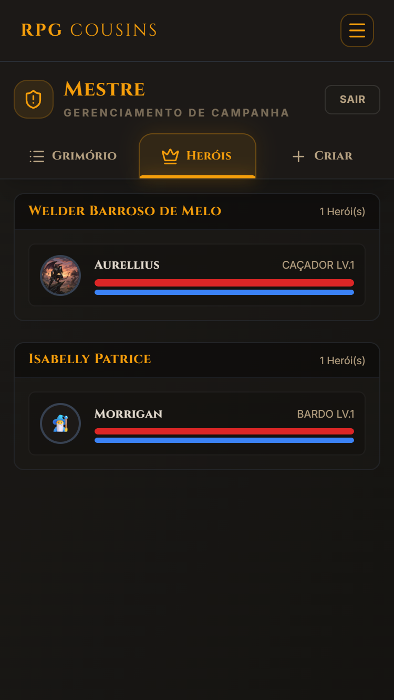

<h1 align="center">RPG-Cousins: Ecossistema de Automação para Tormenta 20</h1>

  

  
  
  
  

## 📌 Visão de Engenharia

O **RPG-Cousins** não é apenas uma ficha online; é uma solução de **Engenharia de Dados e UX** aplicada ao sistema *Tormenta 20*. O projeto nasceu da necessidade de eliminar a carga cognitiva e o erro humano durante as sessões do meu grupo de RPG. 

**O Diferencial:** Através de um "Smart Fork" e scripts de automação em Python, consegui traduzir centenas de páginas de regras em um sistema **Local-First**, onde a inteligência reside no cliente e o Firebase atua apenas como persistência de segurança.

---

## 🛠️ Tour pelas Funcionalidades

### 1. Criação de Herói (O Wizard Inteligente)
O processo de criação guia o usuário através de etapas lógicas, eliminando a necessidade de consultar o livro básico a cada escolha.
* **Automação:** Ao escolher uma Raça ou Classe, o sistema aplica automaticamente os bônus de atributos e perícias treinadas.
* **UX:** Filtros inteligentes mostram apenas as origens e divindades compatíveis com as escolhas anteriores.

  

---

### 2. Ficha do Herói (Motor de Recálculo)
A ficha é o coração operacional do jogador. Ela utiliza um motor de funções puras para gerenciar dependências cruzadas.
* **Efeito Cascata:** Se o herói recebe um bônus de "Força", o sistema recalcula instantaneamente o Ataque, o Dano e a Capacidade de Carga.
* **Persistência Híbrida:** O estado da ficha é mantido via **Zustand** para performance máxima, sendo sincronizado com o Firestore apenas quando mudanças críticas ocorrem.

  

---

### 3. Área do Mestre (Gestão de Ameaças)
Uma interface dedicada para quem conduz o jogo, focada em monitorar o progresso do grupo e gerenciar combates.
* **Interactive Threats:** O mestre pode visualizar e operar fichas de monstros com a mesma facilidade que os jogadores.
* **Controle de Grupo:** Visão holística dos PVs e PMs de todos os membros da mesa em tempo real.

  

---

### 4. Mercado (Economia Dinâmica)
Sistema de inventário e comércio que automatiza a gestão de Tibares (moeda do jogo).
* **Cálculo de Custo:** Compra e venda de itens com atualização automática do peso total carregado e do saldo disponível.
* **Validação de Regras:** Impede a compra de itens superiores ou mágicos sem os pré-requisitos necessários de nível ou ouro.

  

---

## 🚀 Tecnologias Utilizadas

| Camada | Tecnologia | Motivação |
| :--- | :--- | :--- |
| **Frontend** | Next.js 15 | SSR para SEO e App Router para navegação fluida. |
| **Estado** | Zustand | Gestão atômica para evitar re-renders na ficha complexa. |
| **Automação** | Python | Extração de dados (JSON) dos manuais oficiais. |
| **Backend** | Firebase | Persistência leve e Auth para segurança dos usuários. |
| **UI** | Tailwind CSS | Responsividade total para uso em tablets e celulares na mesa. |

## ⚙️ Instalação e Uso

1. **Clone:** `git clone https://github.com/WelderBM/rpg-cousins`
2. **Dependências:** `npm install`
3. **Variáveis de Ambiente:** Configure as chaves do Firebase no arquivo `.env.local`.
4. **Dev:** `npm run dev`

---
**Desenvolvido por [Welder Barroso](https://linkedin.com/in/welder-barroso-37b654207)** *Criatividade aplicada à automação de sistemas complexos.*
